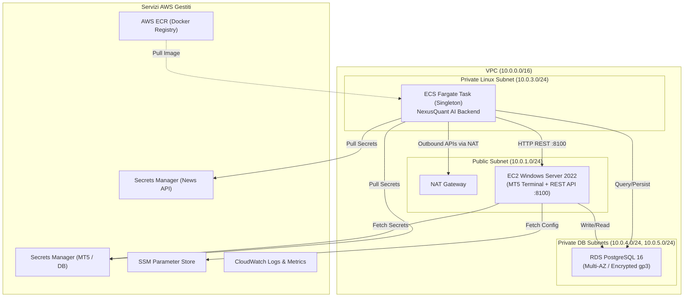

# NexusQuant AI — Infrastructure as Code (IaC)

Repository dedicata alla gestione centralizzata dell'infrastruttura AWS per l'intera suite **NexusQuant**:
- **NexusQuant AI Backend**: Container headless singleton per il trading loop algoritmico su AWS ECS Fargate + ECR.
- **NexusQuant MT5 Connector**: Istanza EC2 Windows Server 2022 con MetaTrader 5 + REST API Adapter FastAPI, supervisionati da Scheduled Task (auto-logon) e watchdog.
- **Database & Storage**: RDS PostgreSQL 16 gp3 per lo storico trade, log e metriche.
- **Networking & Sicurezza**: VPC dedicata multi-AZ, subnet isolate, NAT Gateway, Security Groups dedicati e gestione credenziali con AWS Secrets Manager & SSM Parameter Store.

---

## Architettura



---

## Struttura della Repository

```text
NexusQuant-AI-IaC/
├── .gitignore
├── README.md
├── versions.tf                   # Versioni Terraform e providers (aws, tls)
├── providers.tf                  # AWS Provider con default_tags
├── variables.tf                  # Variabili root con tipi e documentazione
├── outputs.tf                    # Output unificati (RDS endpoint, EC2 IP, ECR url, ecc.)
├── main.tf                       # Orchestratore root che coordina i 7 moduli
├── terraform.tfvars.example      # Esempio completo di configurazione variabili
├── environments/                 # File tfvars specifici per ambiente
│   ├── dev.tfvars                # Configurazione dev (Free Tier friendly)
│   └── prod.tfvars               # Configurazione produzione (Multi-AZ, retention)
└── modules/
    ├── networking/               # VPC, Subnet (pub, win, linux, db), IGW, NAT GW, SGs
    ├── rds/                      # RDS PostgreSQL 16, subnet group, parameter group
    ├── secrets_adapter/          # Secrets Manager + SSM per MT5 Adapter
    ├── ec2_windows/              # EC2 Windows 2022, IAM role, SSM bootstrap document, script runtime (`scripts/`), allarmi CloudWatch
    ├── ecr/                      # ECR repository per immagine backend + lifecycle policy
    ├── secrets_backend/          # Secrets Manager + SSM per backend AI
    └── ecs_backend/              # ECS Cluster, Fargate Service, Task Def, IAM, CloudWatch
```

---

## Moduli Terraform

| Modulo | Descrizione |
|---|---|
| `modules/networking` | VPC `/16`, subnet pubblica, subnet private (Linux, Windows, DB A/B), Internet Gateway, Elastic IP, NAT Gateway e Security Groups. |
| `modules/rds` | Istanza PostgreSQL 16 gestita con gp3 cifrato, parameter group personalizzato e log esportati su CloudWatch. |
| `modules/secrets_adapter` | AWS Secrets Manager (API key, MT5 password, DB credentials) e SSM Parameter Store per l'adapter MT5. |
| `modules/ec2_windows` | Istanza EC2 Windows Server 2022 con bootstrap via SSM Document (Python, Git, MT5, adapter) e tre Scheduled Task: `MT5Terminal` e `MT5AdapterTask` (sessione interattiva con auto-logon, senza limite di esecuzione, riavvio automatico) e `MT5Watchdog` (SYSTEM, ogni minuto: health check, metriche CloudWatch `NexusQuant/MT5`, restart del componente guasto). Allarmi in `alarms.tf`. |
| `modules/ecr` | Repository ECR con tag immutabili, vulnerabilità scan on push e lifecycle policy per pulizia automatica. |
| `modules/secrets_backend` | Secrets Manager (`NEWS_CALENDAR_API_KEY`) e parametri SSM per le soglie di rischio FTMO, LLM e parametri di trading. |
| `modules/ecs_backend` | Cluster ECS Fargate con Container Insights, task definition e servizio singleton (`desired_count = 1`, `deployment_maximum_percent = 100`). |

---

## Guida al Deployment

### Prerequisiti
1. **AWS CLI** installata e configurata (`aws configure`).
2. **Terraform** >= 1.5.0 installato.
3. **Docker** per la build e il push dell'immagine del backend su ECR.

---

### Procedura di Bootstrap Iniziale (Day-0)

Nel primo rilascio assoluto su un account AWS, l'immagine Docker del backend non esiste ancora in ECR. Per evitare che il task definition di ECS fallisca per immagine mancante, si segue questo flusso in 2 step:

#### Step 1: Creazione dell'infrastruttura base ed ECR (con ECS disattivato)

1. Crea o compila il file di variabili (es. partendo da `environments/dev.tfvars` o `terraform.tfvars.example`):
   ```bash
   cp terraform.tfvars.example terraform.tfvars
   # Modifica terraform.tfvars impostando le credenziali e:
   # enable_ecs_backend = false
   ```

2. Inizializza Terraform:
   ```bash
   terraform init
   ```

3. Esegui il plan e l'apply delle risorse base:
   ```bash
   terraform plan -out=tfplan-day0
   terraform apply tfplan-day0
   ```

   Questo creerà:
   - VPC, subnet, NAT Gateway e Security Groups
   - RDS PostgreSQL
   - Secrets Manager e SSM per MT5 e Backend
   - EC2 Windows Server (con avvio bootstrap MT5)
   - Repository ECR per il backend

#### Step 2: Build e Push dell'immagine Docker del Backend

1. Recupera l'URL di ECR stampato negli output Terraform:
   ```bash
   terraform output ecr_repository_url
   ```

2. Effettua il login su ECR con la tua AWS CLI:
   ```bash
   aws ecr get-login-password --region eu-north-1 | docker login --username AWS --password-stdin <ECR_REPOSITORY_URL>
   ```

3. Dalla cartella del backend `NexusQuant AI`:
   ```bash
   docker build -t <ECR_REPOSITORY_URL>:latest .
   docker push <ECR_REPOSITORY_URL>:latest
   ```

#### Step 3: Rilascio del Servizio ECS Fargate (Day-1)

1. Nel tuo `terraform.tfvars`, imposta:
   ```hcl
   enable_ecs_backend = true
   backend_image_tag  = "latest" # o il commit SHA rilasciato
   ```

2. Esegui il plan e l'apply finale:
   ```bash
   terraform plan -out=tfplan-day1
   terraform apply tfplan-day1
   ```

### Risoluzione errori comuni

**Password RDS non valida:** la password di PostgreSQL deve contenere esclusivamente caratteri ASCII stampabili e non può contenere `/`, `@`, `"`, né spazi. Imposta `db_password` in `terraform.tfvars` o in una variabile `TF_VAR_db_password` conforme a questi requisiti.

**Secret già pianificato per la cancellazione:** AWS non consente di ricreare un secret mentre è nella recovery window. Ripristina il secret esistente, importalo nello state Terraform e ripeti l'apply:

```powershell
aws secretsmanager restore-secret `
  --secret-id /nexusquant/dev/backend/secrets `
  --region eu-north-1

terraform import `
  -var-file="environments/dev.tfvars" `
  module.secrets_backend.aws_secretsmanager_secret.backend `
  /nexusquant/dev/backend/secrets

terraform apply -var-file="environments/dev.tfvars"
```

Sostituisci `dev` con l'ambiente corretto. Per gli ambienti di sviluppo puoi usare `secret_recovery_window_days = 0` per evitare una nuova attesa durante le future eliminazioni; questo non annulla una cancellazione già pianificata.

---

## Post-Installazione e Setup MT5

1. **Accesso EC2 Windows**:
   - Tramite RDP (se hai valorizzato `rdp_admin_cidr` con il tuo IP pubblico) usando mstsc all'IP `ec2_windows_public_ip`.
   - Tramite **AWS Systems Manager (Session Manager)** dalla console AWS senza dover aprire la porta 3389.
2. **Login Terminale MT5**:
   - Il bootstrap installa MetaTrader 5 (`mt5_installer_url`, silenzioso via `/auto`).
   - `MT5Terminal` avvia `terminal64.exe` con un file di configurazione generato a ogni avvio
     (`C:\nexusquant\mt5\startup.ini`, password letta da Secrets Manager e cancellata dopo 30 s):
     login/server dell'account broker e `[Experts] Enabled=1, AllowLiveTrading=1` (Algo Trading attivo).
   - Al primo utilizzo resta consigliato un accesso (RDP o Session Manager) per accettare l'EULA e
     verificare che `trade_allowed` risulti vero.
   - L'adapter (`MT5AdapterTask`) attende il terminale, carica secrets/SSM con retry e viene rilanciato
     con backoff se termina. Il watchdog riavvia terminale e/o adapter dopo 3 controlli falliti
     (cooldown 5 min).
3. **Verifica Endpoint**:
   - Dal Fargate backend, l'adapter è raggiungibile all'URL interno privato: `http://<ec2_windows_private_ip>:8100`.
4. **Monitoraggio Log via CloudWatch** (senza accesso RDP/SSM):
   - Il bootstrap installa e configura l'**Amazon CloudWatch Agent**, che fa il tail continuo dei log
     dell'adapter (`C:\nexusquant\logs\mt5_adapter_stdout.log` e `...stderr.log`, più i log dei supervisor
     `terminal-supervisor.log`, `adapter-supervisor.log` e del `watchdog.log`) e li invia al log group **`/nexusquant/mt5-adapter`** (retention 90 giorni).
   - Consultabili dalla console AWS in *CloudWatch → Log groups → /nexusquant/mt5-adapter*, con due log
     stream per istanza (`<instance-id>-stdout` e `<instance-id>-stderr`), oppure via CLI:
     `aws logs tail /nexusquant/mt5-adapter --follow --region <aws_region>`.
   - Il log di bootstrap (Chocolatey, MT5, cloning, ecc.) va invece in **`/nexusquant/ec2-bootstrap`**
     (un solo upload a fine provisioning, non continuo).
5. **Allarmi e metriche** (`modules/ec2_windows/alarms.tf`): namespace `NexusQuant/MT5` (AdapterHealthy,
   TerminalRunning, Mt5Connected, InteractiveSession, TradeAllowed, MemAvailableMB, DiskFreeGB). Per ricevere
   notifiche valorizza `ec2_alarm_action_arns` con uno o più topic SNS; il recover automatico dell'istanza
   (system status check) è sempre attivo.
6. **Applicare le modifiche al bootstrap su un'istanza esistente**: `terraform apply`, poi rilancia
   l'associazione (`aws ssm start-associations-once --association-ids <id>`) o esegui il documento
   `<project>-mt5-bootstrap-<env>` con `aws ssm send-command`. Lo step finale riavvia l'istanza solo se non
   esiste già una sessione interattiva (nessun reboot loop).

---

## Gestione Multi-Ambiente (`dev` / `prod`)

Per applicare le configurazioni specifiche per ambiente:
```bash
# Ambiente DEV
terraform plan -var-file="environments/dev.tfvars"

# Ambiente PROD
terraform plan -var-file="environments/prod.tfvars"
```

---

## Sicurezza e Best Practices
- **Nessuna credenziale nel codice**: Le password di database e le API key sono marcate come `sensitive` e gestite esclusivamente tramite variabili d'ambiente o Secrets Manager.
- **Isolamento di Rete**: Il database RDS e il backend ECS risiedono in subnet private senza IP pubblico. Tutto il traffico in uscita passa per il NAT Gateway con EIP dedicato.
- **Singleton Trading Loop**: Il servizio ECS backend imposta `desired_count = 1`, `deployment_maximum_percent = 100` e `deployment_minimum_healthy_percent = 0`. Questo arresta il vecchio container prima di avviare il nuovo, garantendo che non vi siano mai due trading loop in esecuzione contemporanea con rischio di doppi ordini sul conto trading.
